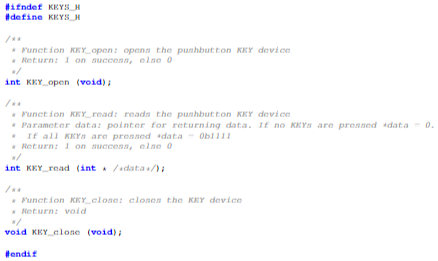
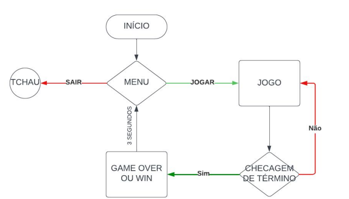

# BricksBreakerOnDe1SOC

## Introdução
 
Os jogos desempenham um papel fundamental tanto no desenvolvimento cognitivo quanto no social. Eles promovem o raciocínio lógico, a criatividade e a resolução de problemas, ao mesmo tempo em que proporcionam oportunidades valiosas para interação, colaboração e construção de relacionamentos (BARANITA, 2012).

Além disso, os jogos não apenas exercitam o corpo, melhorando a coordenação, agilidade e aptidão física, mas também têm um impacto positivo no bem-estar emocional. Ao oferecer momentos de diversão, relaxamento e alívio do estresse, os jogos se tornam uma fonte valiosa de equilíbrio e saúde mental para indivíduos de todas as idades (BARANITA, 2012).

Dada a importância dos jogos para o desenvolvimento humano, nosso grupo foi encarregado de desenvolver um jogo inspirado no clássico Breakout da ATARI. A interação física do jogador com o jogo se dá por meio do acelerômetro disponível no Kit de Desenvolvimento DE1-SoC. Para controlar o jogo, o usuário pode utilizar os botões fornecidos na placa. Além disso, o jogo será visualizado em um monitor CRT utilizando a interface VGA.

## Metodologia

Para a metodologia empregada na construção do projeto solicitado, adotamos uma abordagem que valoriza a modularização e flexibilidade. Utilizamos diversas ferramentas, realizando a leitura e análise dos datasheets correspondentes. A estrutura do projeto foi dividida em partes, com a incorporação de variáveis de configuração, permitindo ajustes conforme as preferências do usuário. Essa abordagem não apenas facilita a manutenção do código, mas também aprimora a legibilidade e assegura escalabilidade. A base do projeto contém instruções essenciais, estabelecendo uma estrutura adaptável para futuras adições de maneira eficiente.

As ferramentas utilizadas no desenvolvimento do projeto foram:

- Kit FPGA DE1-SoC.
- Visual Studio Code para escrita do código em C e Terminal Linux para conexão SSH com a DE1-SoC, compilação e execução do código.
- Lucidchart, para construção de fluxogramas.

Após o conhecimento e análise das ferramentas, o projeto foi dividido nas seguintes etapas, em ordem cronológica:

1. Funções existentes do sistema do Kit (lintelfpgaup)

   1. Leitura do manual em relação ao acesso aos seus dispositivos, como botões, acelerômetro, saída de vídeos e afins.
   2. Utilização das mesmas como forma de auxílio na construção do projeto.

2. Configuração dos dispositivos essenciais

   1. Utilização das funções para configurar o acelerômetro, os botões e também a saída de vídeo.
   2. Definição de onde as funções vão ser usadas no código.
   3. Decisão de quais botões seriam usados para as suas respectivas funções.

3. Construção do jogo

   1. Pesquisas básicas para entender a melhor forma de programar o jogo.
   2. Criação de funções específicas para controle do jogo.
   3. Testes de colisões entre a bola e os blocos através de debuggers.
   4. Constantes pré-configuradas para um ajuste completo do jogo.

4. Integração das funções das placas com as do jogo

   1. Decisão de como o jogo iria ser renderizado (Limpando elementos específicos, ou recriando os mesmos no buffer).
   2. Aplicação dos códigos de geração do píxel de vídeo dentro das funções de exibição do jogo.
   3. Transferindo os valores lidos do acelerômetro para a função de movimento do jogador (raquete).
   4. Aplicando as funções dos botões no fluxo do programa (Opção do menu, pausar, continuar, iniciar e sair).
   5. Telas já pré-moldadas do menu, tela de vitória e derrota, encaixando-as no fluxo do programa.

5. Ajustes finais

   1. Testar o jogo e, ao decorrer de situações inesperadas, ajustar o código final.
   2. Melhorias no fluxo do programa.
   3. Ajuste fino no jogo através das constantes de configurações.

## Descrição do Projeto

### Visão geral da placa
Como foi dito nas seções anteriores, o projeto utilizou do kit de desenvolvimento DE1-SOC. Este kit possui o processador ARM Cortex-A9 dual-core que é utilizado para executar o sistema operacional Linux e outras aplicações de software. Há também a FPGA da família Intel Cyclone V com alguns periféricos que foram utilizados: a interface VGA, botões e acelerômetro. 

Quando compilamos e executamos um programa escrito em C, estamos fazendo isso no processador ARM. Para termos acesso aos periféricos presentes na FPGA, o processador precisa se comunicar a todo momento com a FPGA. Esta comunicação geralmente ocorre por meio de interfaces específicas, que são bridges HPS-to-FPGA, Lightweight HPS-to-FPGA Bridge, Compartilhamento de Periféricos e Interrupções.

Os bridges HPS-to-FPGA (Hard Processor System to FPGA) são interfaces dedicadas que facilitam a comunicação entre o processador ARM (parte do HPS) e a lógica programável da FPGA. Eles são usados para transferir dados, sinais de controle e até mesmo para configurar a lógica da FPGA a partir do processador. Eles mapeiam regiões de memória específicas na FPGA para endereços de memória acessíveis pelo processador ARM. Quando o processador ARM deseja interagir com um periférico na FPGA, ele envia comandos e dados para os endereços de memória correspondentes à região mapeada pela bridge.

Além disso, existe o Lightweight HPS-to-FPGA Bridge, uma versão simplificada da HPS-to-FPGA Bridge e é frequentemente usada para comunicações mais simples e de baixa largura de banda entre o processador ARM e a FPGA.

### Pushbutton Key

Há 4 botões conectados a FPGA da placa. Quando um ou mais é pressionado, ele(s) fecha(m) um circuito elétrico, provocando uma mudança no estado do(s) pino(s) de entrada correspondente(s) na FPGA. A FPGA, por sua vez, monitora continuamente o estado dos pinos de entrada conectados aos botões e detecta a alteração quando um botão é pressionado. Em seguida, a FPGA pode gerar um sinal de interrupção ou outro tipo de sinal para notificar o processador ARM sobre o evento, utilizando uma interface de comunicação como os bridges HPS-to-FPGA. Assim que o processador ARM recebe a notificação da FPGA, ele executa um tratamento de interrupção para lidar com o evento.

Há um Header em C que pode ser incluído ao projeto:

Esse header nos mostra a assinatura de 3 métodos que são utilizados no projeto. O primeiro é o KEY_open() que possibilita a abertura da comunicação do processador ARM com os botões da FPGA. O KEY_close() já realiza o contrário, encerrando a comunicação. O que é utilizado para leitura dos dados dos botões é o KEY_read(). Este método recebe um ponteiro de um inteiro que guarda os valores dos botões (0-Não pressionado e 1-Pressionado). Se todos os botões não estão pressionados, o retorno é 0b0000. Caso todos estejam pressionados, o retorno é 0b1111.

### Acelerometro(G-Sensor)

A placa vem com um módulo de sensor de acelerômetro digital (ADXL345), comumente conhecido como G-sensor. Este G-sensor é um acelerômetro de 3 eixos pequeno, fino e de baixissimo consumo de energia, com medição de alta resolução. A saída digitalizada é formatada como 16 bits em complemento de dois e pode ser acessada por meio da interface I2C.

Conforme mencionado anteriormente, existem funções pré-configuradas para facilitar o uso do dispositivo. Inicialmente, foi necessário realizar a inicialização do sensor, seguida pela etapa de calibração e, por fim, a formatação dos dados recebidos. Após a conclusão desses procedimentos, uma função adicional foi disponibilizada para recuperar os valores nos três eixos (X, Y e Z). No contexto deste projeto específico, optou-se por utilizar o eixo "Z" para controlar o movimento do jogador (raquete).

### VGA

A FPGA possui uma saída VGA (Video Graphics Array), essa interface utiliza um conector de 15 pinos que transmite sinais analógicos de vídeo RGB (vermelho, verde e azul), bem como sinais de sincronização horizontal e vertical para coordenar a exibição da imagem. A sincronização e a configuração da resolução de saída foi pré-configurada no Sistema Operacional presente no processador que está ligado à FPGA, dessa forma, a utilização se dá através de funções na linguagem de programação C.

Existem dois buffers configurados, um "traseiro" e um "frontal", o buffer que é mostrado no display é o frontal, e as novas informações são escritas no traseiro, para mostrar uma informação escrita, é necessario usar a função "video_show()", que alterna os buffers, jogando o frontal para trás e vice versa. 

Além da "video_show()", outras funções importantes para o funcionamento do jogo é a "video_box()", que desenha um quadrado na tela, além da "video_erase()" e "video_clear()", que limpam os caracteres da tela, e os demais pixels, respectivamente. Uma característica interessante da função "video_box()", é a diferença de velocidade ao utilizá-la para desenhar um quadrado, quando comparada à desenhar pixel por pixel usando a função "video_pixel()", a primeira é extremamente mais rápida.

### Fluxo do Jogo

Com o estudo feito de cada periférico a ser utilizado, partimos para o estabelecimento da lógica de controle do jogo:

Inicialmente há um Menu. Por meio do controle dos botões, o jogador pode escolher sair do jogo ou jogar. Só são utilizados nessa tela dois botões. O primeiro alterna entre as duas escolhas e o segundo dá enter. Selecionado enter para jogar, o sistema entra no loop do jogo até que o jogador vença ou perca. Nesta etapa, o controle do player é dado pelo acelerômetro do kit, sendo possível pausar o jogo por meio do botão. Com a finalização do jogo, o usuário retorna para o Menu.

## Resultados e Conclusão

O jogo possui todos os requisitos solicitados, é possível pausar e reiniciar um jogo ao vencer ou perder. O controle da barra do jogador é feito através do acelerômetro, e a velocidade é alterada de acordo com a inclinação do sensor, é possível controlar a direção da bola ao acertá-la no lado direito ou esquerdo da barra.

## Referências

- MARIA DA COSTA BARANITA, I.; SUPERIOR DE EDUCAÇÃO, E.; GARRETT, A. A Importância do Jogo no Desenvolvimento da criança 1. Isabel baranita -2012 A importância do Jogo no desenvolvimento da Criança. [s.l: s.n.]. Disponível em: [https://recil.ensinolusofona.pt/bitstream/10437/3254/1/Dissertacao.pdf].
- FPGAcademy.org. (Mar 2022). Linux with ARM A9. Recuperado de [https://pt.scribd.com/document/695343767/Linux-with-ARM-A9]
- Terasic Technologies. (2015). Manual do Usuário DE1-SoC (Versão 1.2.2). Recuperado de [http://www.terasic.com]

## Autores

- José Gabriel de Almeida Pontes
- Pedro Mendes
- Thiago Pinto Pereira Sena
